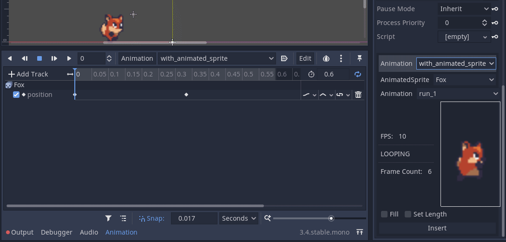
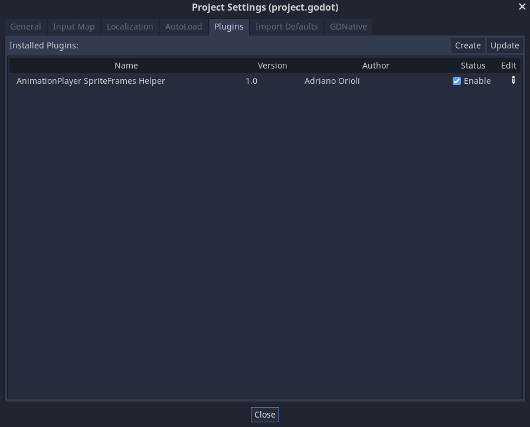
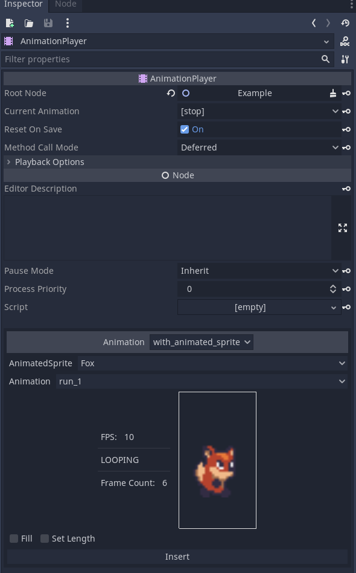
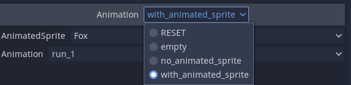
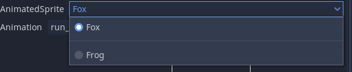
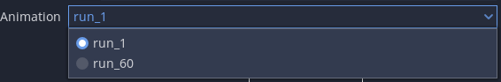
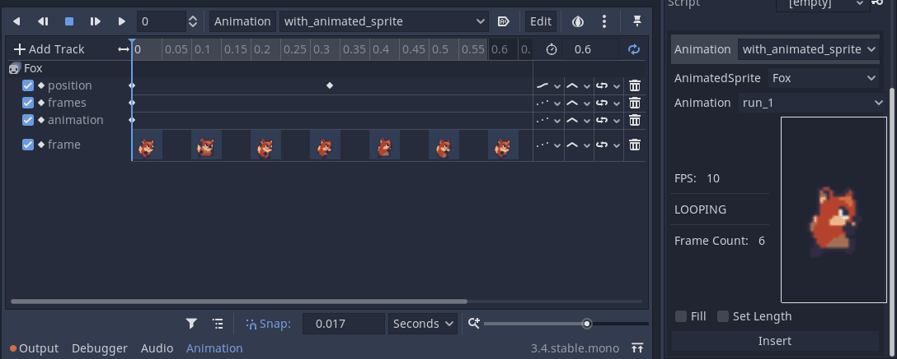

# Godot AnimationPlayer SpriteFrames Helper <!-- omit in toc -->
AnimationPlayer SpriteFrames Helper allows for an easier addition of SpriteFrames animations into the timeline of an Animation.

-------

# Table Of Contents  <!-- omit in toc -->
- [Why?](#why)
- [How To](#how-to)
- [Kikimora Games ❤ Open Source](#kikimora-games--open-source)
  - [Support Us](#support-us)
  
# Why?
An `AnimatedSprite` is an amazing tool for easy spritesheet animation, and `SpriteFrames` are a great data container. Especially when paired with plugins such as [Godot Aseprite Wizard](https://github.com/viniciusgerevini/godot-aseprite-wizard).

However, the `AnimationPlayer` node is much better when it cames to syncing various gameplay elements such as particles, sound effects and colliders to animations. Animating a spritesheet with an AnimationPlayer is a pain because you would need to manually set every keyframe, making sure you're playing it at the correct FPS.

So, `AnimationPlayer SpriteFrames Helper` is here to automate the boring for you.

# How To
* Follow the [ Godot plugin installation guide]( https://docs.godotengine.org/en/stable/tutorials/plugins/editor/installing_plugins.html).
* Enable the plugin in the Project Settings:
    

A new view will now appear in your Inspector dock when you select any `AnimationPlayer`:

You can select which `AnimationPlayer` animation you want to edit:

What `AnimatedSprite` should be targeted in the animation:

What `SpriteFrames` animation to use:

And finally, you can select to `Fill` and `Set Length`:
- `Fill` will fill up the animation for the selected keyframe until the end of the animation
- `Set Length` will set the lenght of the animation to be as long as is required to play the full `SpriteFrame` animation once

Pressing the **`Insert`** button will inject tracks for `frames`, `animation` and `frame` properties into the selected animation, starting from the current playback position. You can adjust this in the animation dock. 

# [Kikimora Games](https://www.kikimora.games/) ❤ Open Source
Kikimora Games is a small indie game studio from Stockholm, Sweden. We believe that making games doesn't have to be done in secret, and that by sharing knowledge our industry can grow and nurture talent.

## Support Us
- [Play and share the games we make](https://kikimora.itch.io/)
- [Follow us on Twitter](https://twitter.com/KikimoraGames)

